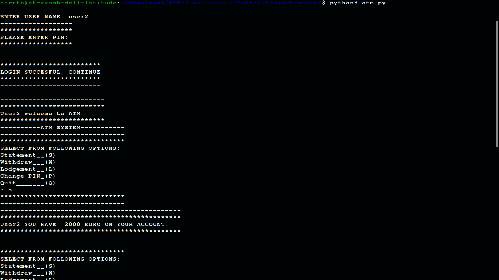
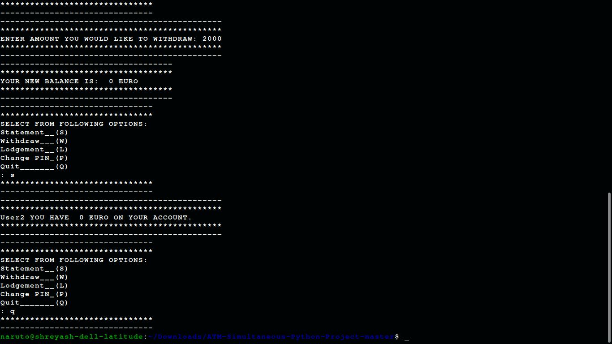

<h1 ALIGN="CENTER">ATM SYSTEM BY USING PYTHON</h1>
<h2 align="center">How to Run</h2>
<ul>
  <li>First you need install python.</li>
  <li>download project,extract project.</li>
  <li>Then open folder in terminal or command prompt</li>
  <li>Then type in terminal -->python3 atm.py<--</li>  
  <li>File execution look like this</li>  
<ul>
  
  
  
<h2 align="center">Features:</h2>
<ul>
<li>Sign In</li>
<li>Account Statement</li>
<li>Withdraw amount</li>
<li>Lodge amount</li>
<li>Change Pin</li>
</ul>
